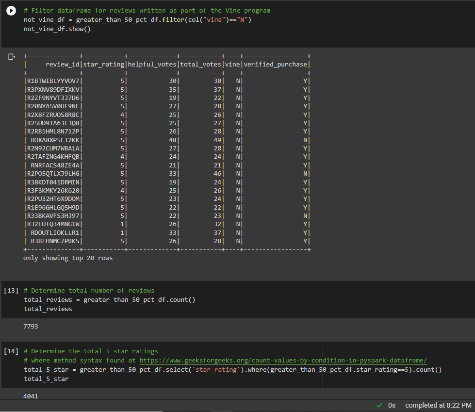
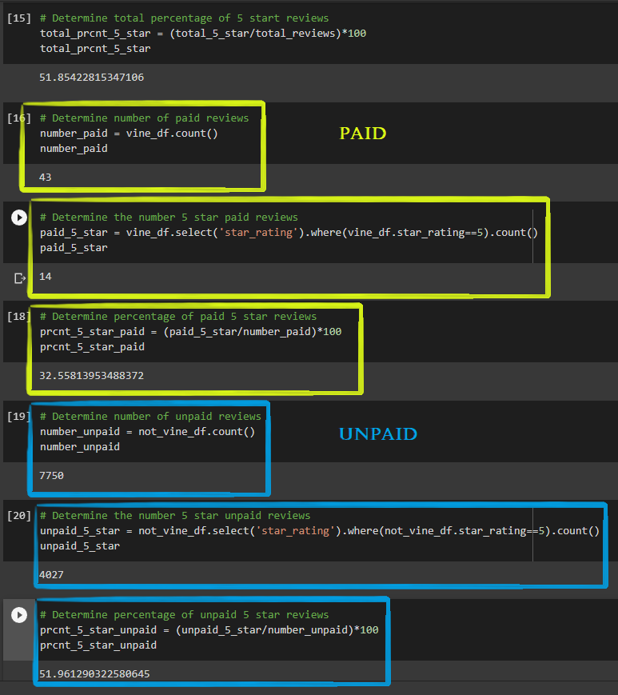

# **Amazon_Vine_Analysis**
### **This project demonstrates the ETL and analysis process of a large dataset acessed through an API call**. 
 

**Technologies**: Amazon Web Services (RDS, S3, limited CLI), Amazon Vine, Google Colab (Python), PGAdmin, PySpark

The code solutions for this project (*.ipynb files*) are executed in Google Colaboratory. This decision was made to provide full accessability in preparation for the handing off of maintenance responsibilites to the client upon this projects completion. The Colab platform also provides access to cloud-based computational resources that guarentee the users ablility to replicate any results regardless of data set size.

* **

## **Overview**
**Background**: Amazon Vine is a service that allows manufacturers and publishers to receive reviews for their products. The manufacturer/publisher pays a fee to Amazon and provides products to Amazon Vine members in exchange for product reviews. 

This project is designed to sift through the review dataset from any subsection provided by Amazon Vine to determine if there is any bias in the number of stars awarded in paid product reviews vs unpaid. There are 50 datasets in total available on Amazon Vine, with each individual dataset corresponding to the reviews from a subcategory of products currently for sale on Amazon. The code provided in the repository accesses reviews from the "*Watches*" subcategory of Amazon Vine. However, the exercise below is conducted using the dataset from the "*Automotive*" subcategory, purely to exemplify the type of insights that can be deduced from evaluation. For all intents and purposes, this repository can be used as a general template to replicate results for any review data subcategory in the future. 
 

* ** 
## **Procedure**
***Note***: The procedure outlined below begins after acquiring the target dataset from Amazon Vine's API. The raw data set is then uploaded to an S3 bucket in Amazon RDS. This step is not required, and exists merely to showcase fluency in using Amazon Web Services. It is also assumed that the postgres tables are already formatted to match the dataframes generated in step 3.

**1.) Import dependencies and drivers that allow spark to interact with postgres.** 
**2.) Load the target data from S3 into a spark dataframe.** 
**3.) The review data are separated using *pyspark.sql* into dataframes matching the pre-existing table frameworks in postgres.** 
&nbsp;&nbsp;&nbsp;&nbsp;&nbsp;&nbsp;a.) The review data are filtered into a table to only include reviews with 20 or more votes. 
&nbsp;&nbsp;&nbsp;&nbsp;&nbsp;&nbsp;b.) The review data are filtered into a table to only include those which recieved a 50% or above "Helpful" vote. 
&nbsp;&nbsp;&nbsp;&nbsp;&nbsp;&nbsp;c.) The data is then separated into two groups: 
&nbsp;&nbsp;&nbsp;&nbsp;&nbsp;&nbsp;&nbsp;&nbsp;&nbsp;&nbsp;&nbsp;&nbsp;- Paid reviews  
&nbsp;&nbsp;&nbsp;&nbsp;&nbsp;&nbsp;&nbsp;&nbsp;&nbsp;&nbsp;&nbsp;&nbsp;- Unpaid reviews  
&nbsp;&nbsp;&nbsp;&nbsp;&nbsp;&nbsp; ***Note***: it is at this time in the code that the review_date column is converted into 'yyyy-MM-dd' format wherever applicable.  

**4.) Connect to AWS RDS instance and write each dataframe to its table.** 
&nbsp;&nbsp;&nbsp;&nbsp;&nbsp;&nbsp; This process can be time consuming, time elapsed is included as comments in *Amazon_Reviews_ETL.ipynb*.

**5.) Gather performance indicators.**
- How many reviews exist in each category? ***(7793)***
- How many reviews were 5 star? ***(4041 - 52% of the population)***
- What percentage of the 5 star reviews are paid? unpaid? **(see Summary)**

See fig. 1, 2

## Summary
In regards to only the automotive section, a somewhat surprising conclusion is drawn when assessing the results. ***The number of paid 5 star reviews is outnumbered by unpaid 5 star reviews by a factor of nearly 300:1***. An overwelming number of unpaid reviews are 5 stars and make up 51.9% of the total unpaid population. Of the 43 paid reviews, only 14 were 5 stars, comprising only 32.6% of the total paid review population. The conclusion drawn from these facts regarding the automotive review section is that **consumers need no additional incentive to report a good experience with a product**. This is proven by the overwhelming ratio of unpaid 5 star reviews to the paid (incentivized) reviews. Note that this conclusion is drawn without the consideration of any ommitted variables that could dictate the skew of population towards the unpaid side.  